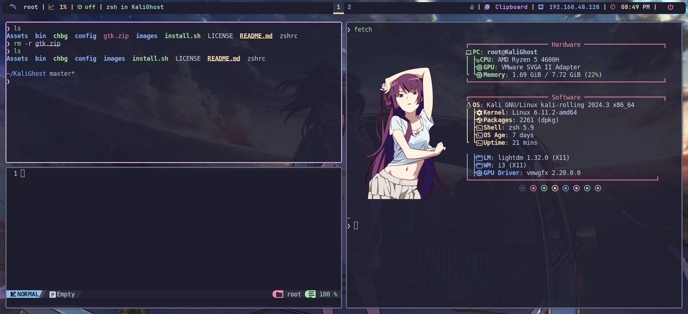
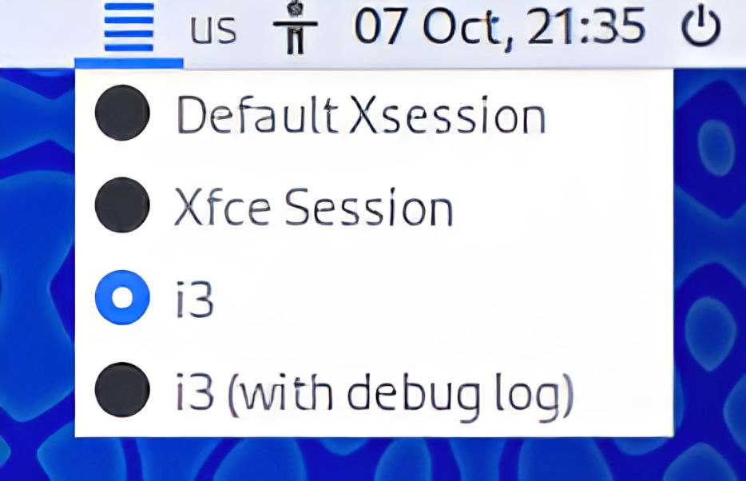

## `🐲` KaliGhost

>[!Important]
>**This is meant to be installed on a _fresh_ Kali install**. You _could_ do this on your battle-hardened Kali machine with all your previous configurations, but make sure you alter the script to preserve your previous configs or back them up first. 

<table>
    <tr>
        <td><b>OS</b></td>
        <td>Kali Linux</td>
    </tr>
    <tr>
        <td><b>Window Manager</b></td>
        <td>i3</td>
    </tr>
    <tr>
        <td><b>Terminal</b></td>
        <td>Kitty</td>
    </tr>
    <tr>
        <td><b>Shell</b></td>
        <td>Zsh</td>
    </tr>
    <tr>
        <td><b>IDE</b></td>
        <td>NeoVim</td>
    </tr>
    <tr>
        <td><b>Font</b></td>
        <td>JetBrains Mono Nerd</td>
    <tr>
        <td><b>GTK Theme</b></td>
        <td>Catppucin</td>
    </tr>
    <tr>
        <td><b>Launcher</b></td>
        <td>Rofi</td>
    </tr>
    <tr>
        <td><b>Status Bar</b></td>
        <td>Polybar</td>
    </tr>
    <tr>
        <td><b>Compositor</b></td>
        <td>Picom</td>
    </tr>
</table>

## `🎥` Video


## `📸` Screenshots




## `💾` Installation
Clone the repo `git clone git@github.com:strinGhost/KaliGhost.git && cd KaliGhost`

Simply `chmod +x install.sh` the installation script if it isn't already marked as executable and then just run it with `sudo ./install.sh`. 

#### One Command Setup for Lazy Sloths🦥
```bash
git clone git@github.com:StrinGhost/KaliGhost.git && cd KaliGhost && sudo ./install.sh
```

After successfully installing everything, make sure you reboot your system.
Once you reboot and you're in the login menu, you will have to select `i3` from the drop-down list and just log in.




## `⌨️` KeyBindings
### Basics
`CapsLock` - `Escape`

##### Terminal
`copy` - copy <filename> <br>
`ll` - ls -la<br>
`fetch` - fastfetch<br>
`c` - clear<br>

`htb-connect` - openvpn ~/ovpn/htb.ovpn <br>
`thm-connect` - openvpn ~/ovpn/thm.ovpn <br>
`target` - target <ip> <host/info><br>
`ip` - <ip> (outputs ip from ~/target)<br>

--- 
<table>
    <tr>
        <td><b>Applications</b></td>
        <td><b>Key Bindings</b></td>
    </tr>
    <tr>
        <td><b>i3</b></td>
        <td><a href=config/i3>ReadMe</a></td>
    </tr>
    <tr>
        <td><b>Tmux</b></td>
        <td><a href=config/tmux>ReadMe</a></td>
    </tr>
    <tr>
        <td><b>Kitty</b></td>
        <td><a href=config/kitty>ReadMe</a></td>
    </tr>
    <tr>
        <td><b>Picom</b></td>
        <td><a href=config/picom>ReadMe</a>
        </td>
    <tr>
        <td><b>WallPapers</b></td>
        <td><a href=images>ReadMe</a></td>
    </tr>
    </tr>
</table>

Feel free to modfiy any configuration as you like these configurations suites me best. If you feel I should update or add something don't hesitate opening an issue or pull request I will try to respond as quick as possible.

## `❓` Why
I created it to simplify the process of setting up a customized Kali Linux environment. As a pentester, I've often found myself spending hours configuring and installing various tools and configurations from scratch. This script aims to automate that process, making it easy for users to get started with a fully functional and customized Kali Linux environment.

