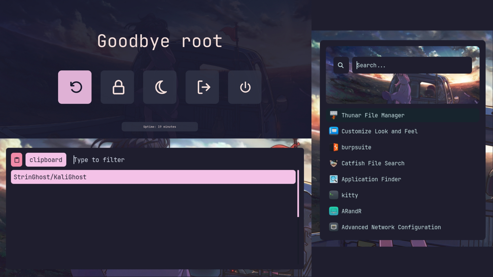

## `🐲` KaliGhost

>[!Important]
>**The `install.sh` script installs the required packages and dependencies. The process may take some time.**

>[!Note]
>**Fresh Kali Install Recommended!**

<table>
    <tr>
        <td><b>OS</b></td>
        <td>Kali Linux</td>
    </tr>
    <tr>
        <td><b>Window Manager</b></td>
        <td>i3</td>
    </tr>
    <tr>
        <td><b>Terminal</b></td>
        <td>Kitty</td>
    </tr>
    <tr>
        <td><b>Shell</b></td>
        <td>Zsh</td>
    </tr>
    <tr>
        <td><b>IDE</b></td>
        <td>NeoVim</td>
    </tr>
    <tr>
        <td><b>Font</b></td>
        <td>JetBrains Mono Nerd</td>
    <tr>
        <td><b>GTK Theme</b></td>
        <td>Catppucin</td>
    </tr>
    <tr>
        <td><b>Launcher</b></td>
        <td>Rofi</td>
    </tr>
    <tr>
        <td><b>Status Bar</b></td>
        <td>Polybar</td>
    </tr>
    <tr>
        <td><b>Compositor</b></td>
        <td>Picom</td>
    </tr>
</table>

## `🎥` Video
https://github.com/user-attachments/assets/6a4bc5f0-91ce-44d6-9548-bca08edd6635

---

## `📸` Screenshots



## `💾` Installation
Clone the repo `git clone https://github.com/StrinGhost/KaliGhost.git && cd KaliGhost`

Simply `chmod +x install.sh` the installation script if it isn't already marked as executable and then just run it with `./install.sh`. 

>[!Note]
**A pre-build binary of Picom latest version is used during the installation. If you dont want to use the pre-build binary. Run the `install.sh` script with --no-picom flag. **

#### **One Command Setup for Lazy Sloths🦥**
```bash
git clone https://github.com/StrinGhost/KaliGhost.git && cd KaliGhost && ./install.sh
```

After successfully installing everything, make sure you reboot your system.
After Rebooting, in Login Menu select `i3` from the drop-down list and log in.


## `⌨️` KeyBindings
<table>
    <tr>
        <td><b>Applications</b></td>
        <td><b>Key Bindings</b></td>
    </tr>
    <tr>
        <td><b>i3</b></td>
        <td><a href=config/i3>ReadMe</a></td>
    </tr>
    <tr>
        <td><b>Tmux</b></td>
        <td><a href=config/tmux>ReadMe</a></td>
    </tr>
    <tr>
        <td><b>WallPapers</b></td>
        <td><a href=https://github.com/StrinGhost/WallPaper-Collection>ReadMe</a></td>
    </tr>
    </tr>
</table>

Feel free to modfiy any configuration as you like these configurations suites me best. If you feel I should update or add something don't hesitate opening an issue or pull request I will try to respond as quick as possible.

## `❓` Why
I created it to simplify the process of setting up a customized Kali Linux environment. As a pentester, I've often found myself spending hours configuring and installing various tools and configurations from scratch. This script aims to automate that process, making it easy for users to get started with a fully functional and customized Kali Linux environment.

