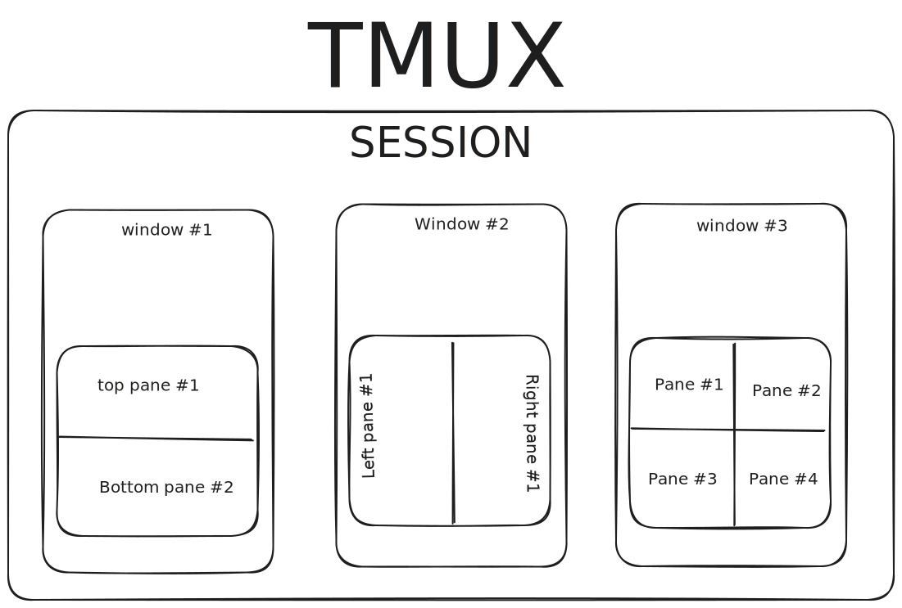

# Prefix key
```
CTRL+Space
```
 
# Panes
```
f   - search pane
x   - kill active pane
z   - toggle zoom state
{   - Swap current & previous pane
}   - Swap current & next pane
```
 
### Move between panes
 ```
 LEFT   -   h
 DOWN   -   j
 UP     -   k
 RIGHT  -   l
 ```

### Split Panes
```
 LEFT   -   Shift+H
 DOWN   -   Shift+J
 UP     -   SHift+K
 RIGHT  -   Shift+L
```

### Select Panes
```
Up     - Select above pane
Down   - Select below pane
Left   - Select left pane
Right  - Select right pane
```

### Resize Panes
 ```
M-Up     - Resize up
M-Down   - Resize down
M-Left   - Resize left
M-Right  - Resize right
```


# Window

```
r   - rename window
c   - Create window


0 to 9      Select windows 0 to 9
```

# Sessions
 
 ```
R   - rename session
s   - switch session
k   - kill session
d   - detach session
```
### Switch Sessions
 ```
(           Switch to previous session.
 )          Switch to next session.
```


# Client
```
D           Choose a client to detach.
```

# General
```
R   - rename session
s   - switch session
r   - rename window
k   - kill session
c   - Create window
f   - search pane
C   - copy mode
d   - detach session
:   - command mode
x   - kill active pane
```


# About Tmux

 ## Sessions
   A session is a single collection of pseudo terminals under the management of tmux.
   Each session has one or more windows linked to it.

 ## Windows
 A window occupies the entire screen and may be split into rectangular **panes**, each of which is  a  separate pseudo terminal. Any number of tmux instances may connect to the same session and any number of windows may be present in the same session.
 **Once all sessions are killed, tmux exits.**



